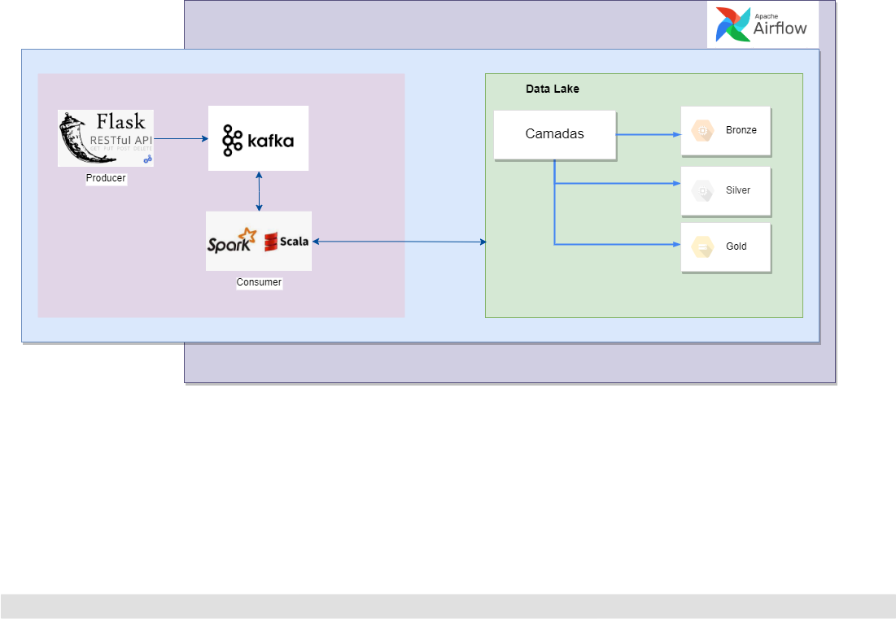

# Projeto
Pipeline de ingestão de dados no datalake baseado na estrutura do dataset https://www.kaggle.com/competitions/new-york-city-taxi-fare-prediction/data?select=train.csv

### Definição Estratégica:
- Criação de um datalake
- Implementação de uma aplicação para geração dos eventos
- Ingestão de dados nas camadas bronze e silver do datalake
- Disponibilização de ferramenta para orquestração do fluxo de trabalho

## Arquitetura da Solução



## Executar a solução

### Pré-Requisitos
#### Instalação do docker compose
- [Docker](https://docs.docker.com/compose/install/)

#### Criação de rede externa
```
  docker network create --driver bridge external-network
```

#### Criação de volume para armazenamento dos dados do dataleke
```
  docker volume create dados-datalake
```

***Observação:*** _caso esteja usando [windows + wsl + docker-desktop], segue o path do datalake:_
```
  \\wsl.localhost\docker-desktop-data\version-pack-data\community\docker\volumes\dados-datalake\_data
```


#### Subir serviço do kafka
```
  docker-compose up -d
```

### Passos:
  - [1 - Gerador de eventos](app-producer)
  - [2 - Ingestão de dados](app-consumer) 
  - [3 - Orquestrador do fluxo de trabalho](airflow)
