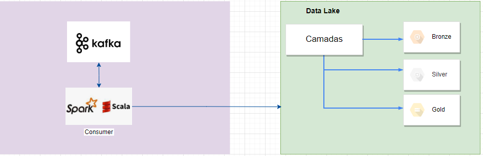

# Objetivo

1. Esse projeto tem como objetivo realizar a ingestão de dados brutos na camada bronze do datalake
2. Realizar Filtro nos dados da camada raw e armazenar o resultado na camada silver


## Solução


## Tecnologias utilizadas
Para o desenvolvimento dessa aplicação foram usadas as seguintes tecnlogias:
- Spark
- Scala
- Maven
- Kafka

## Pré requisitos:
1. Subir o serviço do kafka através do [docker-compose.yml](https://github.com/wesleyst5/case-data-engineer-experian/blob/main/docker-compose.yaml) localizado na raiz do projeto
2. Para rodar a aplicação local é necessário adicionar no arquivo **_/etc/hosts_** a instrução abaixo:
```
  127.0.0.1 kafka
```
3. Configurar o arquivo [application.conf](src/main/resources/application.conf) 

## Para rodar a solução:
### 1. Construa uma imagem docker para ser usada
```
docker build -t spark_lab/spark:latest .
```

### 2. Inicie um container do Docker personalizado com o docker-compose
```
docker-compose up --scale spark-worker=3 &
```

## Build aplicação
A aplicação usa o Apache maven para realizar o build.
```
  mvn clean package
```

#### Referências:

[Config Docker Compose Apache Spark](https://hub.docker.com/r/bitnami/spark/)
