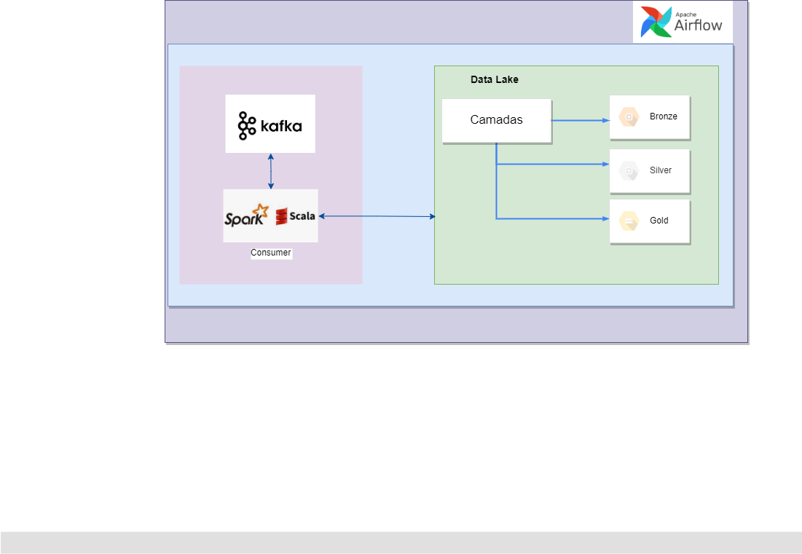
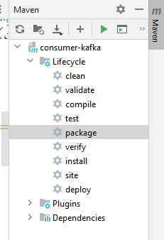
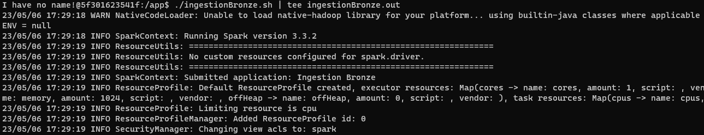
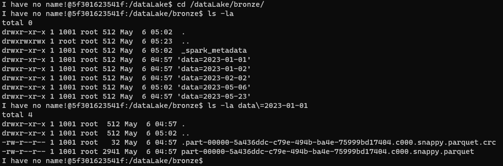
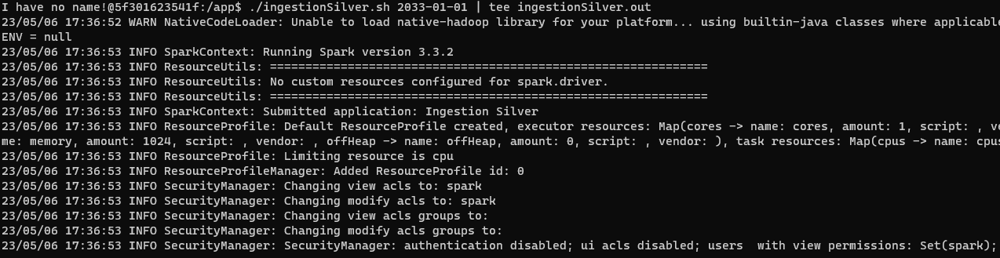
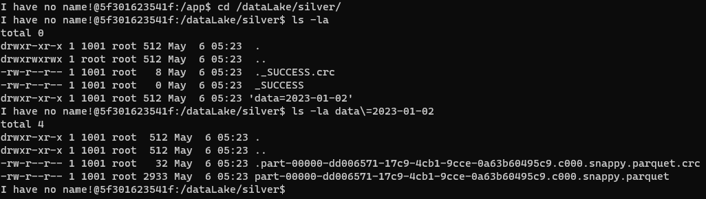

# Objetivo

Realizar ingestão de dados nas camadas bronze e silver do data lake.</br>
Foi implementado um processo streaming para ingestão na camada broze e um processo batch baseado no filtro passado para ingestão na camada silver.

## Solução


## Tecnologias do projeto
- [Spark 3.3](https://dlcdn.apache.org/spark/spark-3.3.2/spark-3.3.2-bin-hadoop3.tgz)
- [Scala 2.12](https://docs.scala-lang.org/)
- [Jdk 11](https://www.oracle.com/br/java/technologies/javase/jdk11-archive-downloads.html#license-lightbox)
- [Maven 3.8](https://maven.apache.org/docs/3.8.1/release-notes.html)

## Ferramentas utilizadas
- [IntelliJ IDEA](https://www.jetbrains.com/idea/download/download-thanks.html?platform=windows&code=IIC)
- [Docker](https://docs.docker.com/compose/install/)
- [Maven](https://maven.apache.org/download.cgi)

## Pré requisitos:
1. Configuração de variável de ambiente
   - JAVA_HOME
   - SPARK_HOME
   - HADOOP_HOME
   
2. Serviço do kafka provisionado.
3. Realizar a configuração de hosts **_/etc/hosts_** para funcionamento no intellij
```
127.0.0.1 kafka
```
4. Configurar os parâmetros no arquivo [application.conf] (src/main/resources/application.conf) se achar necessário
5. Gerar o .jar da aplicação na pasta **target**. Opções:
#### Shell
```
mvn clean package 
```
#### Intellij
```
clicar duas vezes nao opção package do maven  
```



## Build e execução dos spark jobs via Airflow
### 1. Realize o build
```
docker build -t app-consumer-spark .
```

Executar Passo [3 - Orquestrador do fluxo de trabalho](..%2Fairflow)


## Build e execução dos spark Jobs Manual

### 1. Realize o build e deploy da aplicação
```
docker compose up -d --build
```

### 2. Abra seu browser e entre no endereço abaixo, onde já será possível ver spark rodando com 1 worker.
```
http://localhost:8080
```

### 3. Acesse o container do spark master
```
docker exec -it app-consumer-spark bash
```

### 4. Execute os arquivo .sh para submeter o job spark

1. Inicia uma aplicação streaming, que tem por objetivo consumir os eventos publicados no tópico **TAXIFARE** kafka e armazenar na camada **bronze** (raw) no formato **.parquet** particionado por **pickup_datetime** (yyyy-mm-dd) no datalake.
```
./ingestionBronze.sh | tee ingestionBronze.out
```

**Obervação:** _Para gerar os eventos use o endpoint (http://127.0.0.1:5000/api/producer), criado na aplicação a [app-produce](https://github.com/wesleyst5/case-data-engineer-experian/tree/main/app-producer)_

#### Resultado no console:




2. Inicia uma aplicação batch, que tem por objetivo realizar a leitura dos registros da camada bronze e movimentar para a camada silver basedo no parâmetro informado para filtro
```
./ingestionSilver.sh 2033-01-01 | tee ingestionSilver.out
```

**Observaçao:** _para visualizar o log gerado pelos jobs, é possível através dos arquivos .out_

#### Resultado no console:




**Observaçao:** _foi feito mapeamento do volume da pasta dataLake no arquivo docker-compose_

### Referências:

[Config Docker Compose Apache Spark](https://hub.docker.com/r/bitnami/spark/)

[Home](https://github.com/wesleyst5/case-data-engineer-experian)