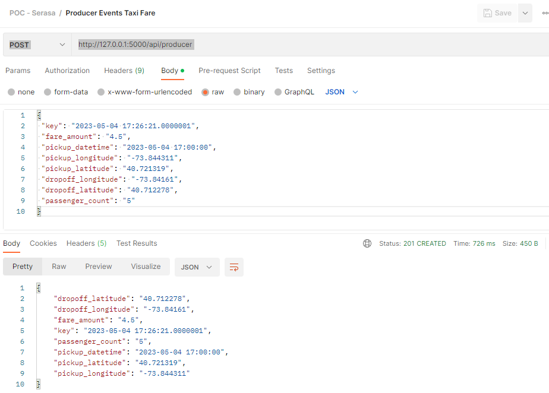
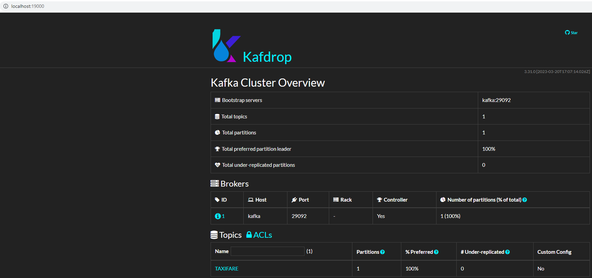
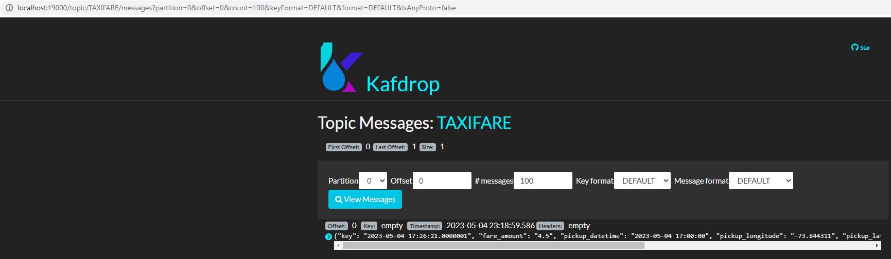

# Objetivo

Gerar eventos através de API para um tópico kafka.</br>
Foi implementado um endpoint (**_api/producer_**) para envio de registro para o um tópico kafka

## Solução


## Tecnologias do projeto
  - [Python 3.8](https://www.python.org/downloads/release/python-380/)
  - [Flask 2.3.2](https://flask.palletsprojects.com/en/2.3.x/)

## Ferramentas utilizadas
- [PyCharm](https://www.jetbrains.com/pycharm/download/#section=windows)
- [Docker](https://docs.docker.com/compose/install/)

## Pré requisitos:
1. Serviço do kafka provisionado.

## Para rodar a solução:
### 1. Builde a imagem e execute o comando abaixo para subir a aplicação
```
  docker compose up -d --build
```
### 2. Realize chamada ao endPoint da aplicação. Segue Sugestões:
#### Curl
```
curl --location 'http://127.0.0.1:5000/api/producer' --header 'Content-Type: application/json' --data '{
 "key": "2023-05-04 17:26:21.0000001",
 "fare_amount": "4.5",
 "pickup_datetime": "2023-05-04 17:00:00",
 "pickup_longitude": "-73.844311",
 "pickup_latitude": "40.721319",
 "dropoff_longitude": "-73.84161",
 "dropoff_latitude": "40.712278",
 "passenger_count": "5"
}'
```
#### Postman
[POC - Serasa.postman_collection.json](doc%2FPOC%20-%20Serasa.postman_collection.json)

## Resultados:



Clicar na url abaixo para acesso ao client kafdrop (apresenta os tópicos e mensagens produzidas no kafka)
```
http://localhost:19000/
```





Executar Passo [2 - Ingestão de dados](..%2Fapp-consumer)

[Home](https://github.com/wesleyst5/case-data-engineer-experian)
